# Convex Hull Layers

This project visualizes the computation of convex hull layers from a set of random points in 2D space. Using a custom QuickHull implementation, the project iteratively computes and animates the removal of convex layers, revealing the nested structure of the point set.

## Features

- **Convex Hull Computation:** Implements the QuickHull algorithm to compute the convex hull of a set of points.
- **Layered Visualization:** Displays multiple layers of convex hulls iteratively, fading out verified layers.
- **Animation:** Smooth, interactive animation using Matplotlib.
- **Customization:** Easily configurable parameters for number of points, animation speed, colors, and more.

## Example Output

Here are snapshots of the animation at various stages with different point densities:

RANDOM
| 50 Points             | 100 Points             | 1000 Points            |
|-------------------------|------------------------|------------------------|
| 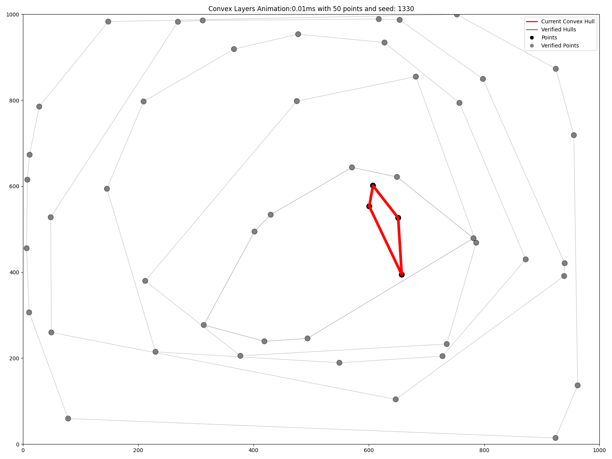 | 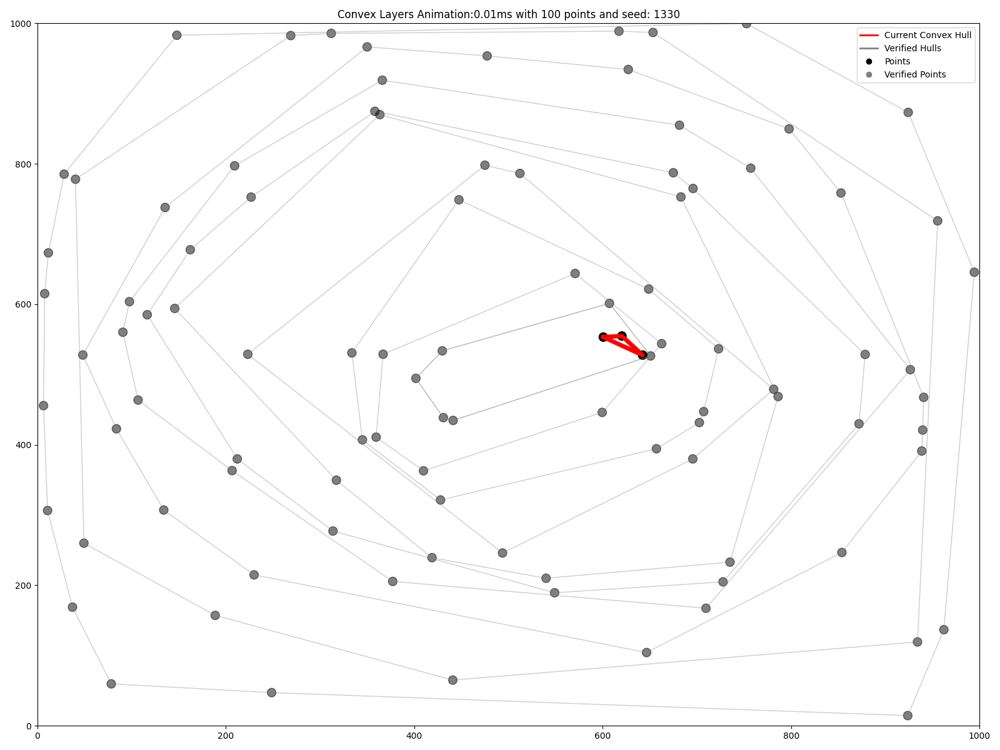 | 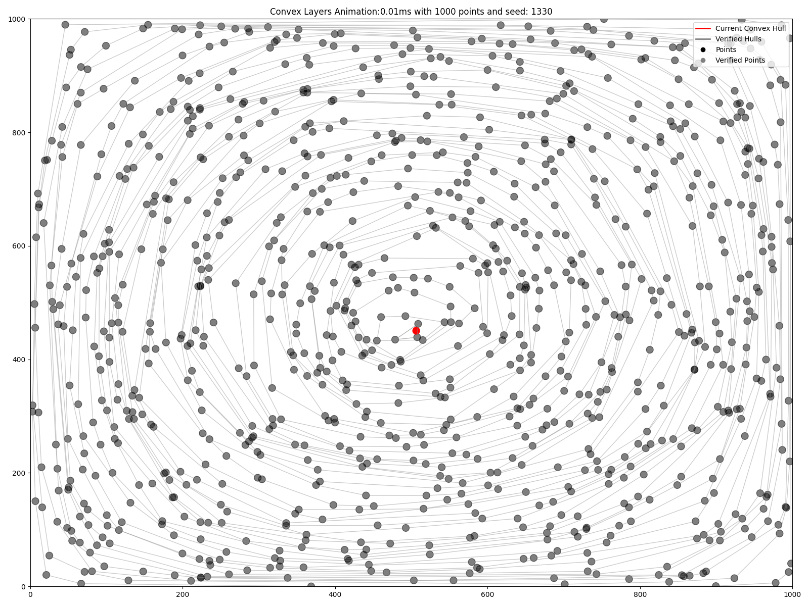 |

| 5000 Points            | 10000 Points           |
|------------------------|------------------------|
| 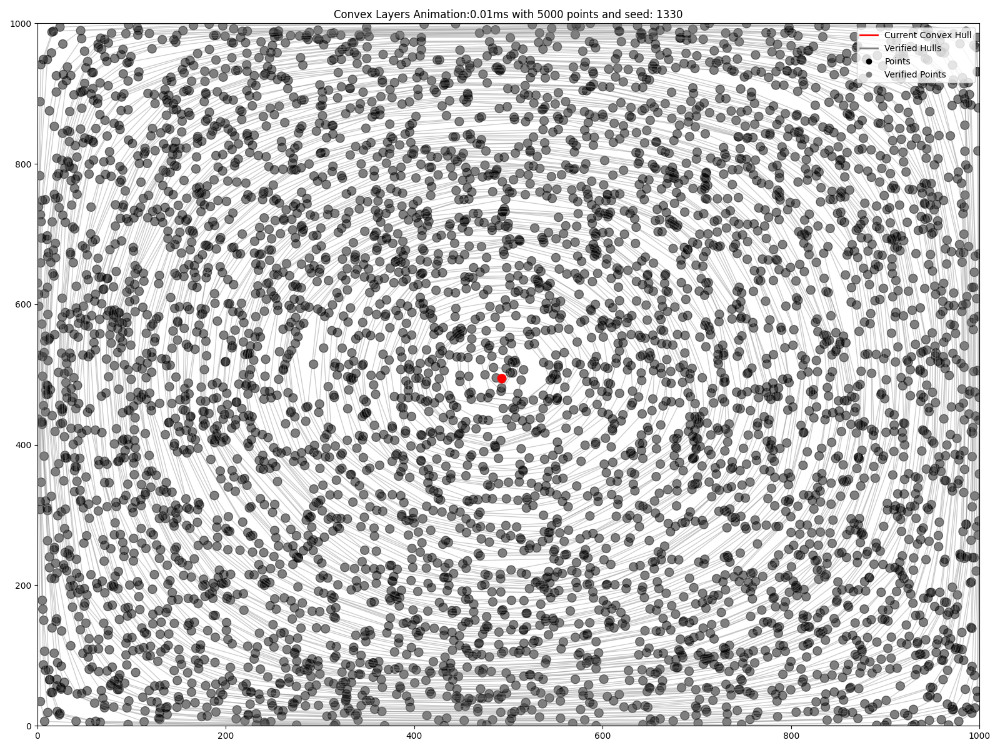 | 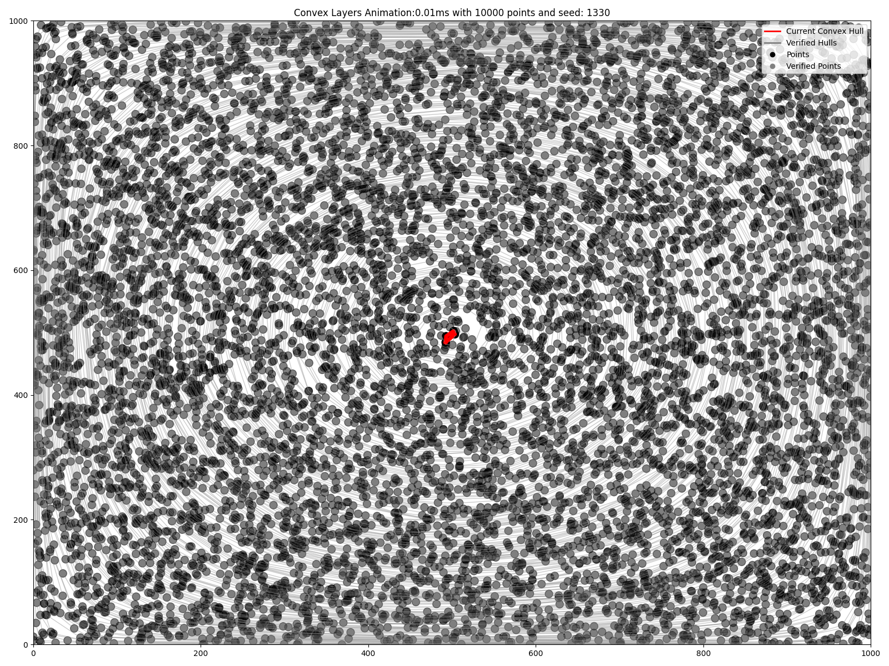 |
---
GRID
| 50 Points             | 100 Points             | 1000 Points            |
|-------------------------|------------------------|------------------------|
| 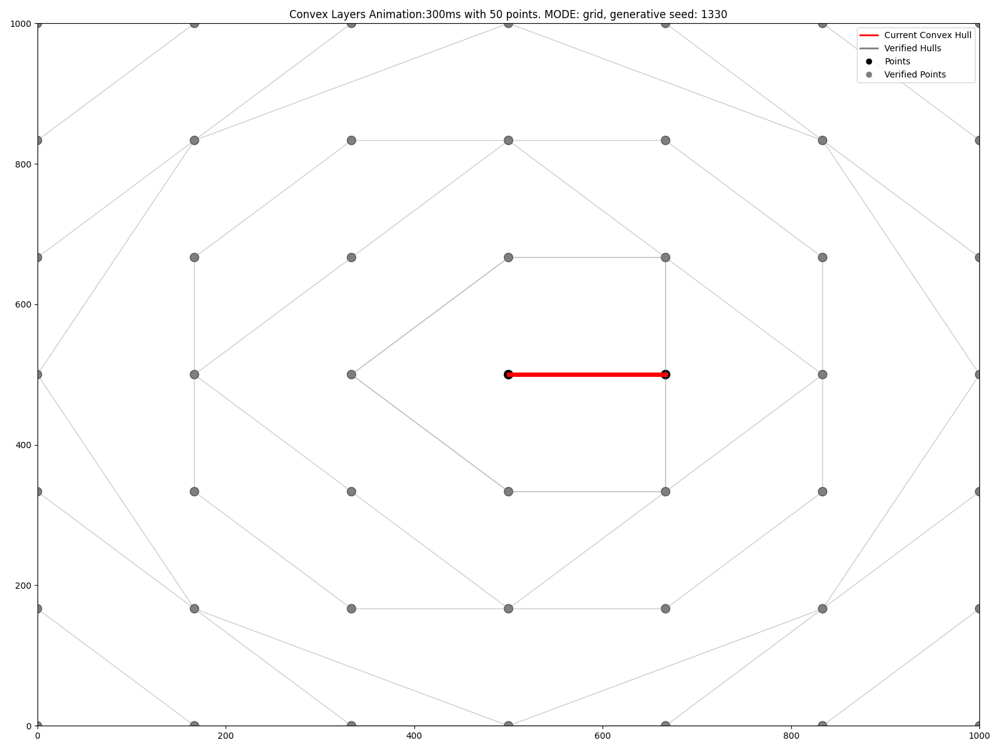 | 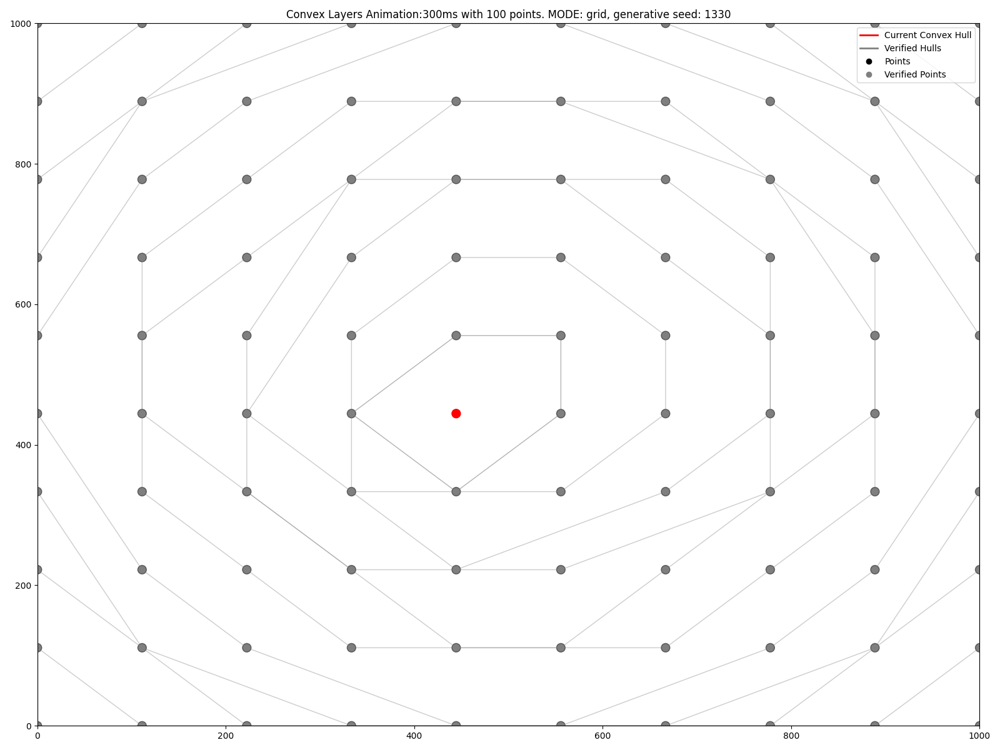 | 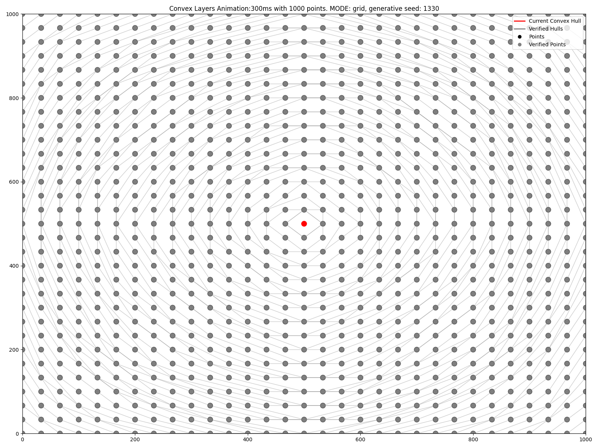 |

| 5000 Points            | 10000 Points           |
|------------------------|------------------------|
| 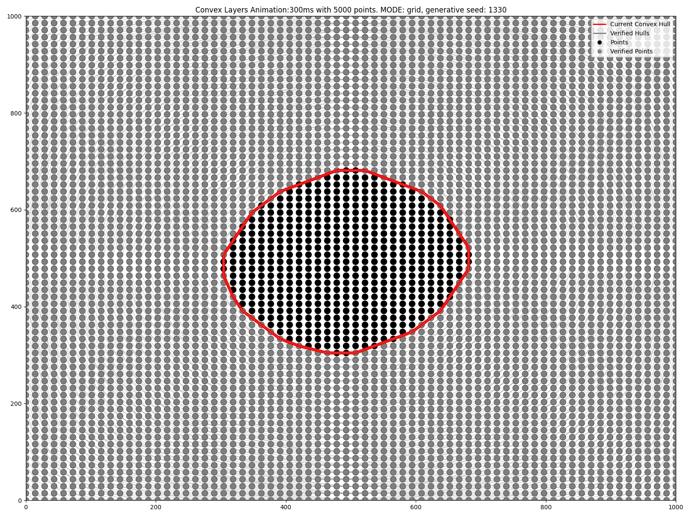 |  |
---
COLLINEAR
| 50 Points             | 100 Points             | 1000 Points            |
|-------------------------|------------------------|------------------------|
| 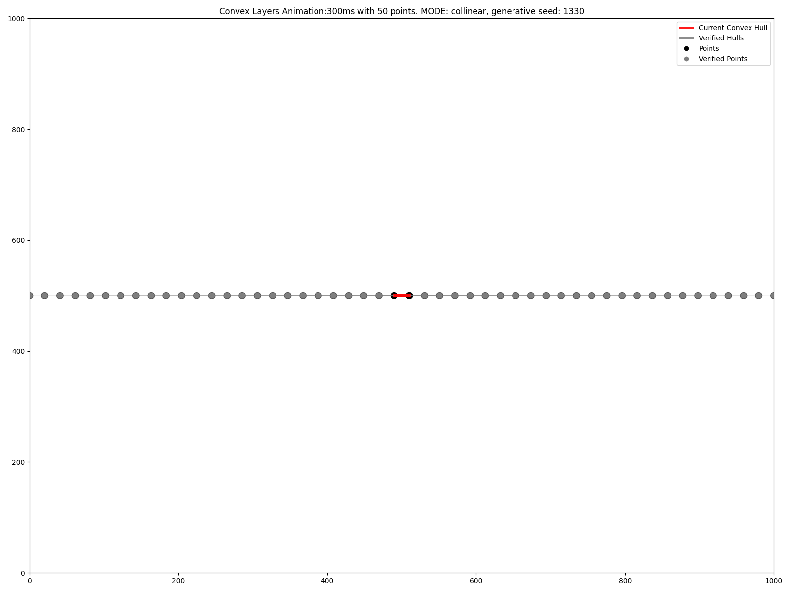 | 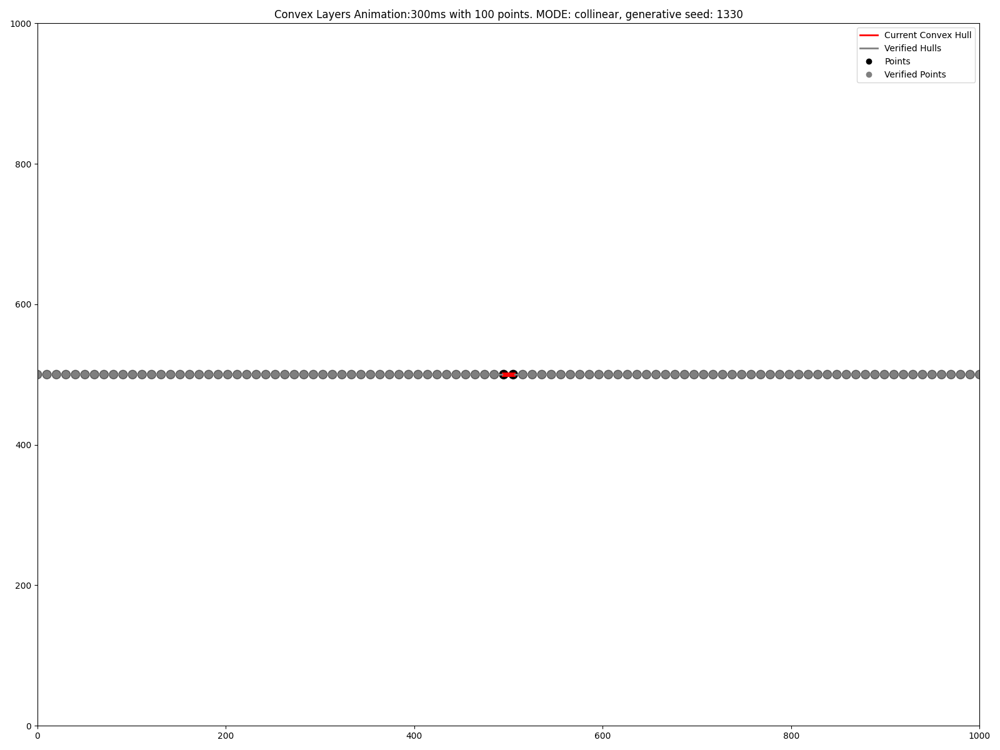 | 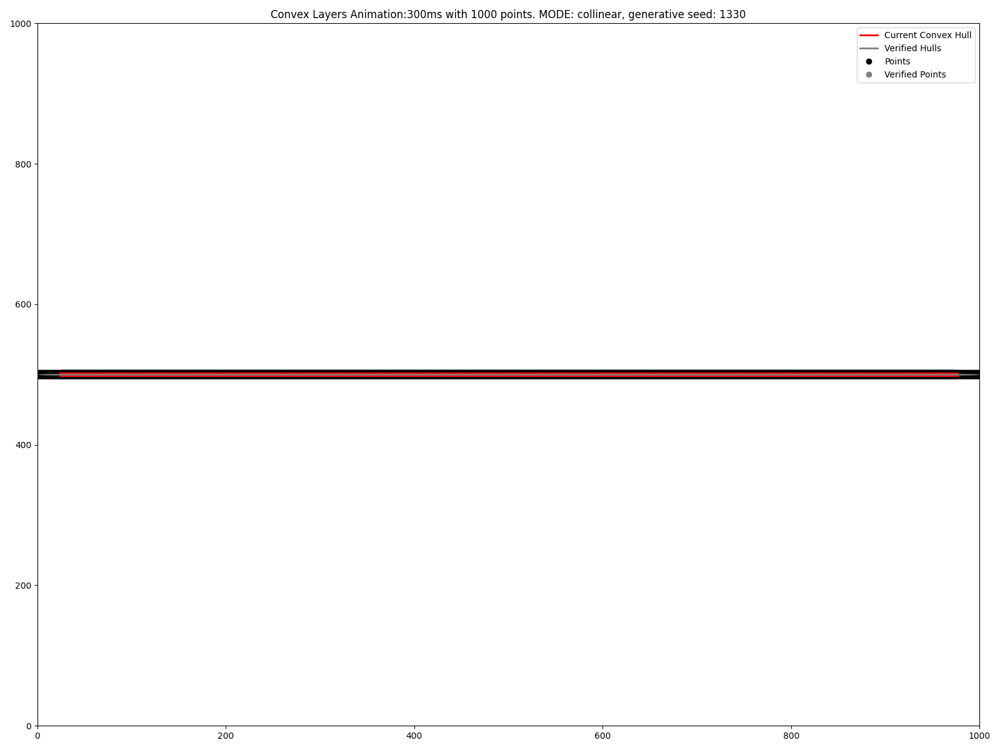 |

| 5000 Points            | 10000 Points           |
|------------------------|------------------------|
| 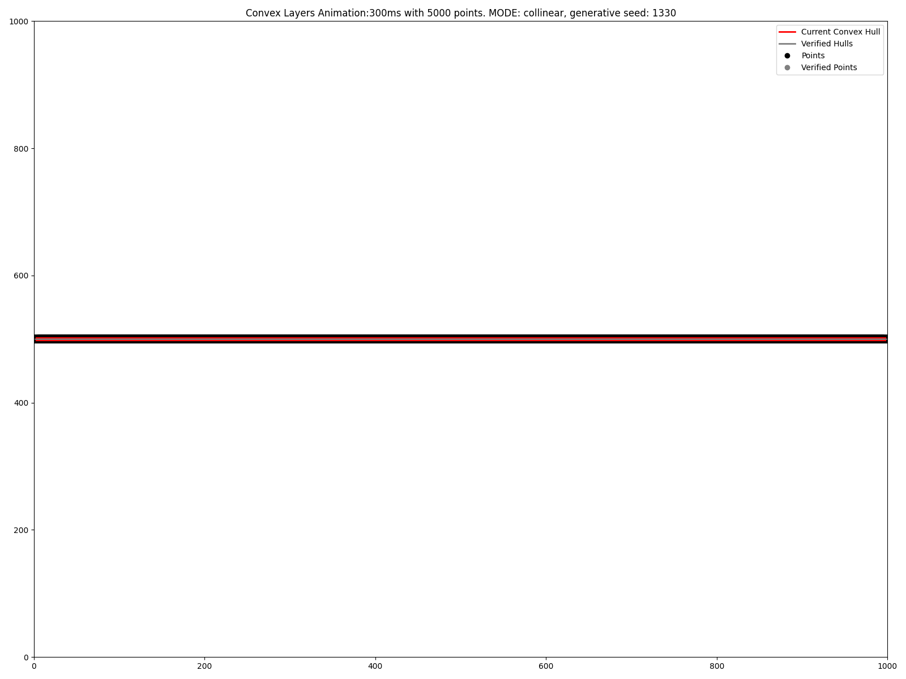 | 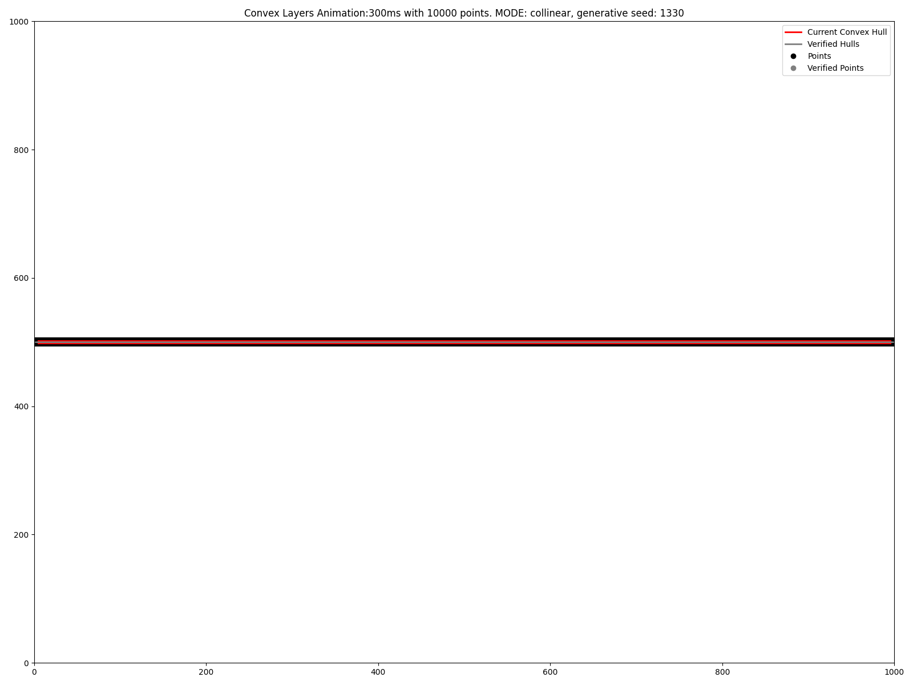 |

Each image demonstrates how the convex hull layers evolve as the number of points increases. 

# Convex Hull Computation Results

This project benchmarks the performance of convex hull computation on various
point distributions, including **Grid** and **Random**. Below are the results
obtained using a tested random seed.

---

## Results: Grid Points

| Points Volume | Peak Memory Usage (KB) | Time Taken (s) | Layers Computed |
|---------------|-------------------------|----------------|-----------------|
| 10,000        | 1725.53                | 33.0277        | 233             |
| 9,000         | 1530.57                | 29.9298        | 242             |
| 8,000         | 1377.21                | 22.8521        | 204             |
| 7,000         | 1207.35                | 17.5911        | 183             |
| 6,000         | 1043.53                | 14.0624        | 169             |
| 5,000         | 876.31                 | 10.5404        | 151             |
| 4,000         | 719.00                 | 7.6051         | 137             |
| 3,000         | 527.11                 | 4.4042         | 106             |
| 2,000         | 351.04                 | 2.3906         | 85              |
| 1,000         | 174.64                 | 0.7385         | 52              |
| 500           | 88.58                  | 0.2486         | 33              |
| 250           | 42.21                  | 0.0732         | 21              |
| 100           | 20.10                  | 0.0210         | 12              |
| 50            | 12.14                  | 0.0077         | 8               |
| 10            | 9.82                   | 0.0008         | 3               |
| 1             | 6.51                   | 0.0000         | 1               |

---

## Results: Random Points

| Points Volume | Peak Memory Usage (KB) | Time Taken (s) | Layers Computed |
|---------------|-------------------------|----------------|-----------------|
| 10,000        | 1734.36                | 30.6178        | 224             |
| 9,000         | 1563.72                | 25.7663        | 211             |
| 8,000         | 1399.27                | 21.1703        | 195             |
| 7,000         | 1232.80                | 16.7581        | 177             |
| 6,000         | 1063.74                | 12.9371        | 159             |
| 5,000         | 900.45                 | 9.6142         | 142             |
| 4,000         | 731.13                 | 6.5915         | 123             |
| 3,000         | 548.26                 | 4.1922         | 101             |
| 2,000         | 366.12                 | 2.0854         | 77              |
| 1,000         | 183.49                 | 0.6556         | 50              |
| 500           | 92.99                  | 0.2196         | 31              |
| 250           | 47.35                  | 0.0710         | 19              |
| 100           | 20.02                  | 0.0174         | 10              |
| 50            | 11.96                  | 0.0065         | 7               |
| 10            | 9.58                   | 0.0007         | 3               |
| 1             | 0.58                   | 0.0000         | 1               |

---

## Observations

1. **Memory Usage**: Memory usage scales with the number of points but shows efficient resource management, even for larger datasets.
2. **Computation Time**: Convex hull computation time increases with the number of points, but the grid distribution tends to take slightly longer compared to random points.
3. **Number of Layers**: The number of convex layers decreases as the total number of points reduces, showcasing the hierarchical nature of convex hull computation.

---

## How to Run

1. Clone the repository:
   ```bash
   git clone https://github.com/your-repo-name.git


## Installation

1. Clone the repository:
   ```bash
   git clone https://github.com/ml3m/QuickHull_Convex_Layers_Animation.git
   cd QuickHull_Convex_Layers_Animation
   ```

2. Install dependencies:
   ```bash
   pip install -r requirements.txt
   ```

## Usage

Run the main script:
```bash
python main.py
```

The animation will display a series of convex hull layers computed from the random points. Points from verified layers will gradually fade out as the animation progresses.

## Configuration

Customize the behavior of the animation by editing `config.py`:
- **RANDOM_SEED**: Set the seed for reproducibility.
- **NUMBER_POINTS**: Number of random points to generate.
- **POINTS_RANGE**: Range of coordinates for the points.
- **X_LIM, Y_LIM**: Limits of the plot.
- **X_WINDOW, Y_WINDOW**: Window size of the Matplotlib figure.
- **ANIMATION_INTERVAL_MS**: Frame interval for the animation.
- **Colors and Sizes**: Adjust colors and sizes for points, lines, and hulls.

## QuickHull Implementation

The convex hull computation is based on the QuickHull algorithm, implemented in `convexhull_quickhull_implementation.py`. Key features:
- Efficient recursive approach to find hull points.
- Handles degenerate cases with fewer than three points.
- Computes additional properties such as area and simplices.
